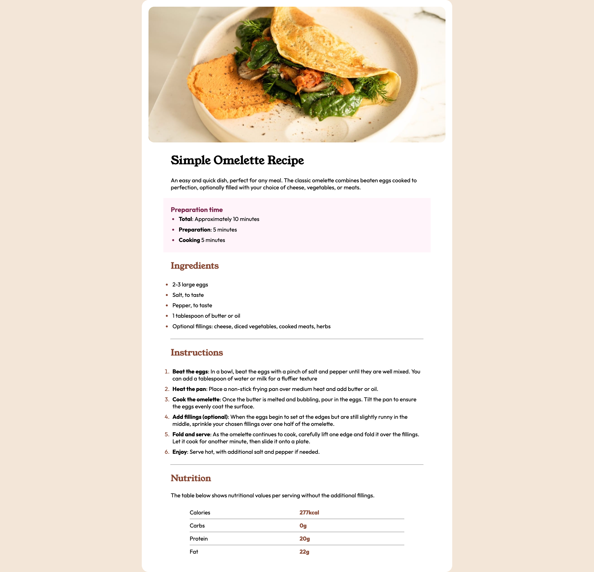

# Frontend Mentor - Recipe page solution

This is a solution to the [Recipe page challenge on Frontend Mentor](https://www.frontendmentor.io/challenges/recipe-page-KiTsR8QQKm). Frontend Mentor challenges help you improve your coding skills by building realistic projects. 

## Table of contents

- [Frontend Mentor - Recipe page solution](#frontend-mentor---recipe-page-solution)
  - [Table of contents](#table-of-contents)
  - [Overview](#overview)
    - [Screenshot](#screenshot)
    - [Links](#links)
  - [My process](#my-process)
    - [Built with](#built-with)

## Overview

### Screenshot

### Links

- Solution URL: [https://github.com/oduntane/recipe-page](https://github.com/oduntane/recipe-page)
- Live Site URL: [https://recipe-page-fm-odn.netlify.app](https://recipe-page-fm-odn.netlify.app)

## My process

### Built with

- Semantic HTML5 markup
- CSS
- Mobile-first workflow
- [React](https://reactjs.org/) - JS library
